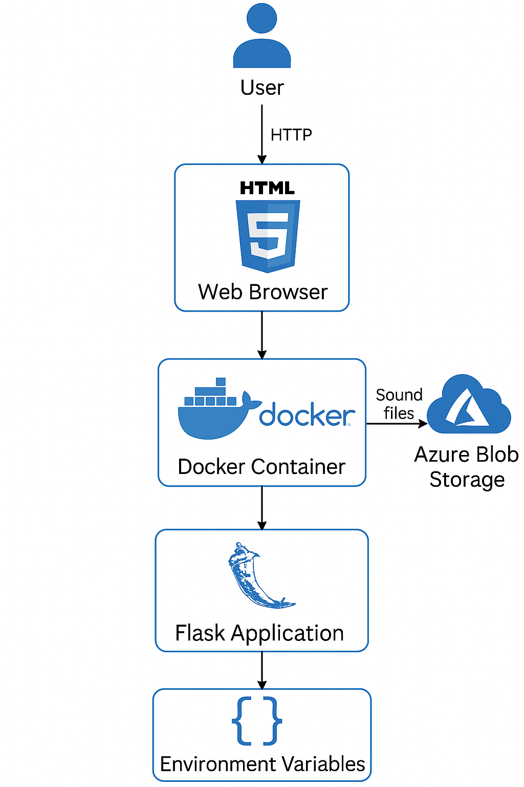

# 1) Executive Summary
## Problem
Humor plays a massive roll in human interaction for everyone. It can be amazing if comedy is pulled off well, but that task is difficult to master without the proper tools.
## Solution 
Few things are funnier than a well-timed sound effect. With my soundboard app, anyone can easily click on a sound that is perfect for any scenario. Is your friend taking too long to answer your question? Click on the Jeopardy sound effect and let them know in a humorous way! If your coworker completes a task they've been stressing about. Click on the Applause sound effect and make them smile! It can be used by anyone and is sure to brighten the day of everyone around you.

# 2) System Overview
## Course Concenpts
- Based on Case-07
- Azure blob storage
- Docker container use
## Architecture Diagram

# 3) How to Run (Local)
## Build
docker build -t soundboard .
## Run
docker run --rm -p 8080:8080 --env-file .env soundboard
## Environment Variables
To run the application, create a `.env` file in the project root.  
Use the following variables:

STORAGE_ACCOUNT_URL=<your-azure-blob-storage-url>
STORAGE_ACCOUNT_KEY=<your-azure-storage-key>
AUDIO_CONTAINER=<your-container-name>

# 4) Design Decisions
## Why this concept?
- I considered having a visible play button on each sound tile, but decided that clicking on the tile itself was intuitive enough and made it visually look more like a soundboard.
- I also considered creating the app so that only one sound could play at once, but decided that that limited the abilities of the user.
- I also played around with different colored tiles and different tile annimations, but ultimately decided that black text with large white tiles on the off-whtie background was the easiest to read and the least overwhelming.
## Tradeoffs
- The choice to have one "Stop All Sounds" button sacraficed the ability of the user to have the control to stop some sounds and not others for the sake of positive simplicity for both the user and the visual appearance of the app.
- The choice to add emojis to the sound tiles may make some feel that the app looks childish, but I decided it was worth it in order to increase clarify and add a much-needed pop of color to the app.

# 5) Results and Evaluation
## Performance/Test Notes
- While testing this product I was able to make my girlfriend, my TA, and a couple of my classmates laugh.   
- I was easily able to find ways to use the product in conversation during testing.
- The sounds have never failed to play when their respective tiles have been clicked on during testing, nor has the "Stop All Sounds" button failed to stop all sounds from playing.

# 6) What's Next?
## Planned Improvements
- Add more sound effects.
- Categorize sound effects either by grouping them into physical locations on the soundboard or by using some other key such as color.
- Add a search bar to search for sound effects.
- Add more audio controls such as a loop mode in a way that doesn't overwhelm the user.
## Refactors 
- Replace hardcoded file lookups with a JSON or YAML manifest so adding/removing sounds doesn’t require editing Python code.
- Add more informative error messages for missing audio files, invalid requests, or bad environment configuration.
## Stretch Features
- Let users toggle between light/dark or choose custom themes.
- Add a sound mixing system where sounds can be played at the same time with different volumes.

# 7) Links
## Github Repo
https://github.com/max-farnham/soundboard
